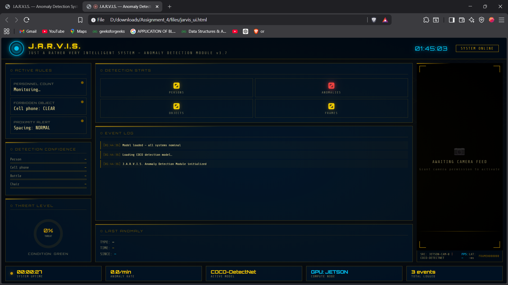
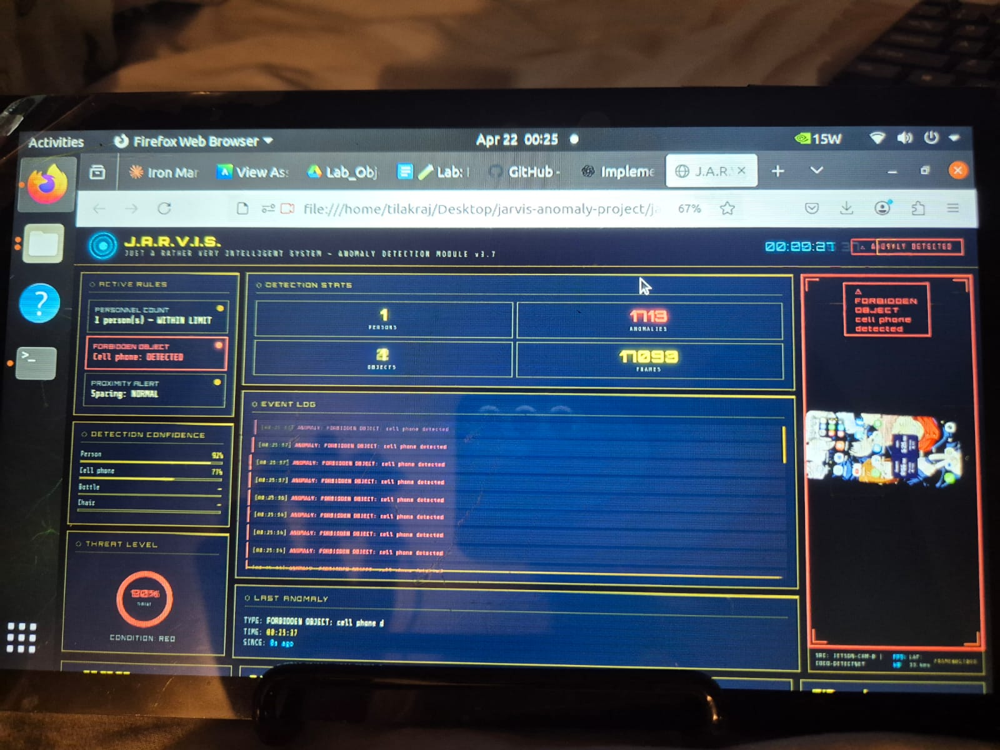

# J.A.R.V.I.S. — Real-Time Anomaly Detection System
### *Iron Man–Themed Anomaly Detection on NVIDIA Jetson*

<p align="center">
  
</p>

---

##  About The Project

This project implements a **real-time anomaly detection system** running on an **NVIDIA Jetson** device using the `jetson-inference` object detection pipeline. The UI is inspired by **Iron Man's J.A.R.V.I.S.** — featuring gold-on-black HUD aesthetics, arc reactor animations, threat-level meters, and live bounding-box overlays.

The system continuously analyzes a USB camera feed, applies rule-based anomaly logic, and surfaces alerts in a JARVIS-themed browser dashboard.

---

##  Features

| Feature | Description |
|---|---|
| **Overcrowd detection** | Alert when >3 persons appear in frame |
| **Forbidden object** | Flag cell phones (or any custom class) |
| **Proximity alert** | Detect persons standing too close together |
| **Live HUD dashboard** | Iron Man / JARVIS themed browser UI |
| **WebSocket bridge** | Python → HTML in real time |
| **CSV anomaly log** | Timestamped `anomaly_log.csv` |
| **Frame capture** | Save annotated frames on detection |

---

##  Built With

- [NVIDIA Jetson Inference](https://github.com/dusty-nv/jetson-inference) — SSD-MobileNet-v2 / COCO
- Python 3 + asyncio + websockets
- Vanilla HTML/CSS/JS (no framework needed)

---

##  Getting Started

### Prerequisites

```bash
# On Jetson (JetPack 5.x)
sudo apt-get install python3-pip
pip3 install websockets

# jetson.inference is pre-installed with JetPack
# If not: https://github.com/dusty-nv/jetson-inference/blob/master/docs/building-repo-2.md
```

### Installation

```bash
git clone https://github.com/YOUR_USERNAME/jarvis-anomaly-detection.git
cd jarvis-anomaly-detection
```

### Running

**1. Start the Python backend on Jetson:**
```bash
python3 anomaly_detector.py --camera 0 --threshold 0.5
```

**2. Open the UI in a browser (on Jetson or your laptop on the same network):**
```
# On Jetson itself:
open jarvis_ui.html in Chromium

# From another machine (same network):
# Edit jarvis_ui.html line:  new WebSocket('ws://JETSON_IP:8765')
```

**3. Point the USB camera at the scene — anomalies will trigger live!**

---

## Anomaly Rules

Edit `RULES` dict in `anomaly_detector.py`:

```python
RULES = {
    "max_persons":         3,            # Crowd limit
    "forbidden_classes":   ["cell phone"],  # Banned objects
    "proximity_threshold": 0.30,         # 30% of frame width
    "min_confidence":      0.50,
    "cooldown_seconds":    2.0,          # Debounce
}
```

---

##  Output Files

```
output/
├── anomaly_log.csv          # timestamp, frame, rule, detail, objects
└── anomaly_images/          # annotated frames (optional)
```

**Sample `anomaly_log.csv`:**

| timestamp | frame | rule | detail | objects_in_frame |
|---|---|---|---|---|
| 2025-04-21T14:32:01 | 000342 | overcrowd | 4 persons detected (limit 3) | person, bottle |
| 2025-04-21T14:34:17 | 001204 | forbidden_cell_phone | Forbidden object: 'cell phone' (78% conf) | person, cell phone |

---


## Jetson Detection Screenshot


<p align="center">
  
</p>

---

## Project Structure

```
jarvis-anomaly-detection/
├── anomaly_detector.py     # Jetson inference + WebSocket server
├── jarvis_ui.html          # Iron Man JARVIS dashboard
├── output/
│   ├── anomaly_log.csv
│   └── anomaly_images/
├── docs/
│   ├── banner.png
│   ├── ui_normal.png
│   ├── ui_anomaly.png
│   └── jetson_photo.jpg
└── README.md
```

---

##  Customization

- **Change the camera source:** `--camera 1` for second USB cam
- **Add new rules:** Extend `evaluate_rules()` in `anomaly_detector.py`
- **Confidence tuning:** `--threshold 0.65` to reduce false positives
- **Cooldown:** Adjust `cooldown_seconds` to avoid duplicate logs

---

## Observations & Results

> *(Fill this in after running your system)*

- Total frames processed: `___`
- Total anomalies detected: `___`
- False positive rate: `___` (estimated)
- Most common anomaly type: `___`

**Improvement ideas:**
1. Add helmet detection rule (missing PPE)
2. Confidence ensemble — require 2 consecutive frames for alert
3. Email/SMS alert via Twilio when anomaly count exceeds threshold

---

##  Acknowledgements

- [jetson-inference by dusty-nv](https://github.com/dusty-nv/jetson-inference)
- [Best-README-Template](https://github.com/othneildrew/Best-README-Template)
- Iron Man / J.A.R.V.I.S. for the aesthetic inspiration

---

*"Sometimes you gotta run before you can walk." — Tony Stark*
